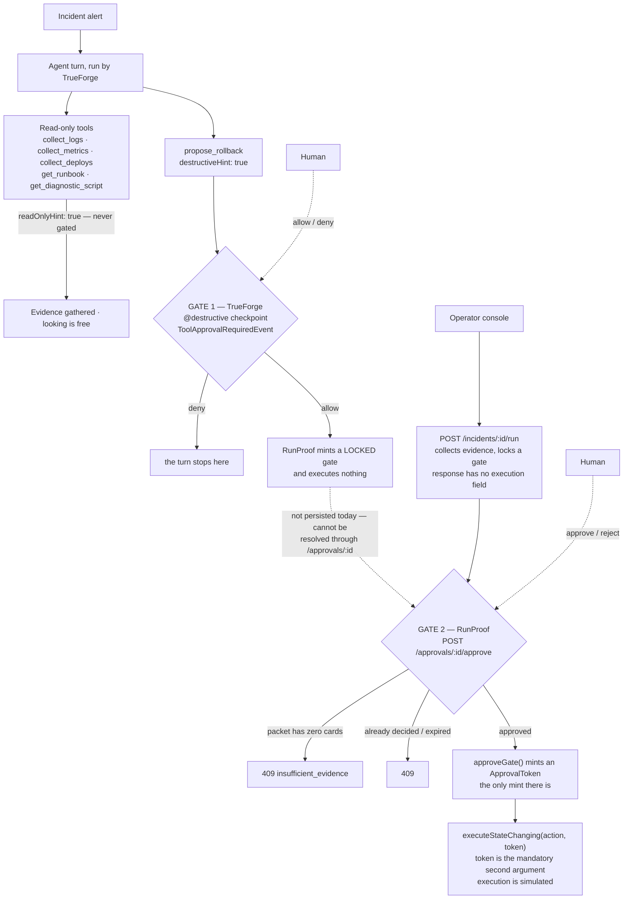
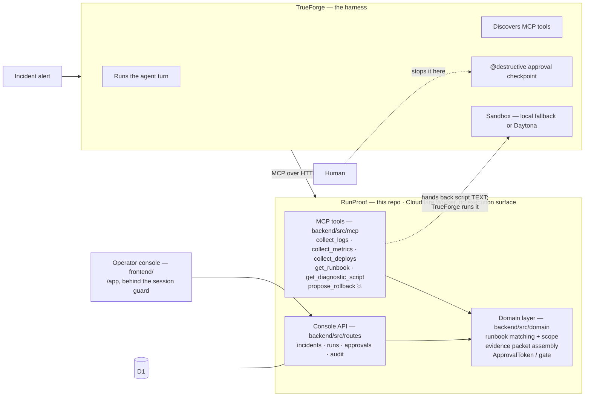

# RunProof

RunProof is an evidence-gated runbook executor for incident response, built for
**The Agent Harness Hackathon** ("Give AI models a License to act").

When an alert fires, an agent follows a runbook the team already wrote: it reads
logs, metrics, and deploy history, runs a diagnostic in a sandbox, assembles an
evidence packet, and proposes a remediation — which stays **locked** until a human
approves it.

> Looking is free. Touching needs a signature.

## Submission at a glance

For a judge with five minutes:

| | |
|---|---|
| **What the agent does** | An alert fires. The agent follows the runbook the team already wrote — pulls logs, metrics and deploy history, runs a diagnostic in a sandbox, assembles an evidence packet, and proposes a rollback. The rollback stays **locked** until a human approves it. |
| **How TrueForge is used** | TrueForge is the harness, not a dependency bolted on afterwards. It runs the agent loop, discovers RunProof's six tools over MCP, and enforces the human-in-the-loop checkpoint directly from the `destructiveHint`/`readOnlyHint` annotations the tools declare — the five evidence tools run freely, `propose_rollback` pauses the turn until a human sends `allow` or `deny`. TrueForge's sandbox is also what executes the diagnostic script, because RunProof itself has no execution surface at all. |
| **Demo video** | See [Demo](#demo). |
| **Try it live** | Console <https://runproof-frontend.sahilsilare.workers.dev> · API <https://runproof-api.sahilsilare.workers.dev/health> |
| **Run it locally** | `./scripts/dev.sh` — one command, both servers. See [How to run it](#how-to-run-it). |
| **Qodo review evidence** | All 25 merged PRs went through Qodo review. Representative: [**PR #1 — the non-forgeable approval gate**](https://github.com/sahil9001/evidence-gated-runbook-executor/pull/1). Full log in [Qodo Code Review Evidence](#qodo-code-review-evidence). |
| **Honest scope** | [What is NOT built](#what-is-not-built), including the one thing worth knowing up front: tool discovery and the annotation-driven checkpoint are verified against a running TrueForge, but driving a full live agent turn needs a model-provider key this repo does not ship. |

## Demo

> **Placeholder — the ~3 minute demo video is not linked yet.** Replace this
> block with the URL before submitting. Nothing else in the README depends on it.

The walkthrough runs the system end to end: TrueForge discovering all six MCP
tools with `propose_rollback` marked destructive and the evidence tools marked
read-only; filing an incident against `payment-service` in the console and
starting a run; the evidence packet assembling from logs, metrics and deploy
history; the Approval tab showing a **locked** gate and a run response carrying
no `execution` field, so nothing has run yet; a human approving, which mints the
single `ApprovalToken` that lets `executeStateChanging` be called at all; and
the audit log recording who approved what, and when.

## Why the approval gate is the point

Incident response is exactly the place an autonomous agent is most tempting and
most dangerous: the pressure to act fast is highest, and the actions available
(rollback a deploy, restart a service, page someone) are hard to undo. RunProof's
premise is that an agent should be free to gather and reason about evidence — that
part is safe and reversible — but the moment it wants to change production state,
a human has to look at the same evidence and explicitly sign off.

That split is now enforced by two independent runtime checkpoints:



1. **TrueForge's approval checkpoint (enforced).** RunProof's `propose_rollback`
   MCP tool is annotated `destructiveHint: true`. TrueForge's default
   `require_approval_for_tools: ["@write", "@destructive"]` matches on that
   annotation and pauses the agent's turn — emitting a `ToolApprovalRequiredEvent`
   — until a human sends an explicit `allow`/`deny` decision. Read-only tools
   (`collect_logs`, `collect_metrics`, `collect_deploys`, `get_runbook`,
   `get_diagnostic_script`) are all `readOnlyHint: true` and are never gated.
   This gate stops the agent's tool call before it ever reaches RunProof's
   code; RunProof's `propose_rollback` handler itself still only mints a
   locked gate and returns it — it executes nothing.
2. **RunProof's own evidence-gated approval API (enforced).** `POST
   /incidents/:id/run` collects evidence and locks a gate but executes
   nothing either — the response has no `execution` field. Only `POST
   /approvals/:id/approve` can change that: it refuses with `409
   insufficient_evidence` if the packet has zero cards, atomically claims the
   run so two concurrent approvals can never both win, and only then calls
   `approveGate()` — the only function in `backend/src/domain/approval.ts`
   that can mint an `ApprovalToken`, a branded type made non-forgeable at
   runtime via a `WeakSet` identity check (the `unique symbol` brand
   TypeScript uses is erased at runtime and can't stop a hand-built object
   from type-casting its way past a naive check on its own). That token is
   the only way to call `backend/src/domain/executor.ts`'s
   `executeStateChanging` — a **mandatory** second positional argument with
   no overload or wrapper that omits it, so "execute without a token" is a
   compile error, not a runtime check the route could forget. Execution is
   simulated (see [What is NOT built](#what-is-not-built)); `executeStateChanging`
   also re-validates the token against the action's fingerprint at the moment
   of execution, so a token minted for one action can't be replayed against
   another.

This second gate lives on RunProof's own HTTP API (`/incidents/:id/run` →
`/approvals/:id/approve`), independent of the MCP tool surface TrueForge
drives. The two are not yet unified: `propose_rollback`'s own locked gate is
minted in memory and returned in the tool result, but never persisted to
RunProof's store, so it cannot currently be resolved through
`/approvals/:id` — an agent-proposed rollback and an operator-run/approved
one are, today, two separate flows built on the same domain machinery, not
one connected pipeline. See [`docs/writeup.md`](docs/writeup.md) for the full
argument.

## Architecture

> The diagram below is the summary. [`docs/architecture.md`](docs/architecture.md)
> has the full picture: request pipeline and middleware order, the operator and
> agent flows as sequence diagrams, run and gate state machines, and the schema.



- **TrueForge is the harness.** It runs the agent loop, discovers RunProof's
  tools over MCP, decides which tool calls need a human in the loop (via the
  `destructiveHint`/`readOnlyHint` annotations RunProof's tools declare), and
  provides the sandbox that actually executes the diagnostic script RunProof
  hands back.
- **RunProof is a remote MCP server plus a domain layer**, not a thin wrapper
  around TrueForge. The runbook-scope enforcement (an MCP tool call is refused
  if the matched runbook doesn't authorize that evidence source), the evidence
  packet assembly, and the non-forgeable approval gate are all RunProof's own
  logic, independent of TrueForge.
- **RunProof never executes code.** It is a Cloudflare Worker with no shell, no
  filesystem, no subprocess. `get_diagnostic_script` only returns script text;
  TrueForge's sandbox (local fallback, or Daytona when hosted) is what runs it.
- A polished Next.js frontend (`frontend/`) presents the evidence packet, the
  locked/approved gate state, and a disclosed risk-score display — see
  [What is NOT built](#what-is-not-built) for what that score actually is.
- **An authenticated operator console** (`frontend/src/app/app/`) sits on top
  of that: sign-in, an incident list and detail view, runbooks, run history, a
  filterable audit log, and a run screen whose Evidence / Diagnostics /
  Approval / Audit tabs are where an approval is actually granted or refused.
  The landing page at `/` is unauthenticated; everything under `/app` is behind
  the session guard.

## Repository structure

```text
.
├── backend/                 # RunProof: Cloudflare Worker (Hono) + MCP server
│   ├── src/domain/          # runbook, evidence, action, approval gate
│   ├── src/mcp/             # the 6 MCP tools + collectors
│   ├── src/routes/mcp.ts    # /mcp transport, Origin allow-list, sessions
│   └── scripts/             # register-mcp-server.mjs, register-model-provider.mjs
├── frontend/                 # Next.js product UI + operator console
│   ├── middleware.ts         # session guard over /app/*
│   ├── src/app/page.tsx      # public landing page
│   ├── src/app/(auth)/       # /login, /register
│   └── src/app/app/          # the console, behind the guard
├── testing/
│   ├── runbooks/             # checkout-failure.json
│   ├── fixtures/             # fixed logs/deploys snapshot the diagnostic reads
│   └── tests/
└── docs/
    ├── architecture.md       # how the pieces fit, in Mermaid
    ├── trueforge-setup.md    # step-by-step TrueForge integration + judge walkthrough
    ├── writeup.md            # the agent's job, and what's enforced today vs. not yet
    ├── runbook-format.md
    └── cloudflare-deployment.md
```

## How to run it

### Quickest path: one command

```bash
./scripts/dev.sh
```

Installs what is missing, applies the local D1 migrations, starts the backend
on `http://localhost:8787` and the frontend on `http://localhost:3000`, waits
until both actually answer, and prints where to go next. Ctrl+C stops both.
That is everything needed to click through the console — register an account,
file an incident, run it, approve the gate. TrueForge is only needed for the
MCP/agent half, covered in the numbered steps below.

> One gotcha the script also prints: a run needs a runbook whose trigger
> matches. Only one ships, and it triggers on service **`payment-service`**
> with signals **`timeout`** and **`error_rate`**. An incident against any
> other service creates fine and then fails at "start run" with
> `no_matching_runbook` — that is the matcher working, not a bug.

### Step by step

You need: Node 22 LTS, a local [TrueForge](https://trueforge.dev) instance
(`npx @truefoundry/trueforge`, verified against v0.1.4), and — only for a full
end-to-end agent turn — a free Gemini API key. No API keys are committed
anywhere in this repo.

**1. Start TrueForge** on `http://localhost:8790`. No Daytona account is needed —
TrueForge logs a "local sandbox fallback is available" message at startup and
uses that instead.

**2. Start the RunProof backend:**

```bash
cd backend
npm install
npm run dev   # wrangler dev, http://localhost:8787
curl http://localhost:8787/health   # {"status":"ok","service":"runproof-api"}
```

**3. Register RunProof's MCP server and a model provider with TrueForge:**

```bash
cd backend
npm run register:mcp             # PUTs the MCP manifest, verifies tool discovery
export GEMINI_API_KEY="..."      # free, no card: https://aistudio.google.com/apikey
npm run register:model           # registers gemini-2.0-flash as the model provider
# or do both in one step:
npm run trueforge:setup
```

Tool discovery works with **zero** model configuration — `GET
/api/v1/mcp-servers/runproof/tools` will list all 6 tools right after step 3's
first command. The model provider is only needed to drive a live agent turn.

**4. Run the frontend and the operator console:**

```bash
cd frontend
npm install
npm run dev   # http://localhost:3000
```

`/` is the landing page and needs nothing else running. For the console at
`/app`, the backend from step 2 must be up: register an account at
`http://localhost:3000/register`, and you land in the console signed in.

The console talks to the backend at `NEXT_PUBLIC_API_URL`, which defaults to
`http://localhost:8787` — the same address step 2 prints, so no `.env` is
needed for local dev. `frontend/.env.example` documents it, and
[`docs/cloudflare-deployment.md`](docs/cloudflare-deployment.md) covers what to
set when the two are deployed.

Full step-by-step detail, including exactly what a judge should expect to see at
each stage (tool discovery → a read-only call → the sandboxed diagnostic →
`propose_rollback` pausing for approval), is in
[`docs/trueforge-setup.md`](docs/trueforge-setup.md).

### Verification

```bash
cd backend && npm test && npm run typecheck   # 492 tests, clean typecheck
cd ../frontend && npm test && npm run lint && npm run typecheck && npm run build
```

These are the same commands CI runs on merge (minus the frontend `build`, which
the deploy job covers via `opennextjs-cloudflare build`) — see
[`.github/workflows/deploy.yml`](.github/workflows/deploy.yml).

`frontend` runs 185 tests of its own. Both counts are from a local run at
PR #25; CI runs the same two suites on every merge to `main`.

## Qodo Code Review Evidence

All 25 merged PRs went through a full Qodo review cycle. Every substantive
change in this repository landed through a reviewed pull request; nothing was
pushed straight to `main`.

**Representative merged PR: [#1 — backend foundation and the non-forgeable
approval gate][pr1].** It is the one to open first, because Qodo's review there
shaped the project's core safety property: it caught that forged tokens passed
authorization, since the `unique symbol` brand TypeScript uses is erased at
runtime and could not stop a hand-built object from type-casting past the
check. The `WeakSet` identity check the rest of this README keeps pointing at
exists because of that review.

[pr1]: https://github.com/sahil9001/evidence-gated-runbook-executor/pull/1

This section is meant as evidence of a working review loop, not a trophy list —
the most interesting fact is that **several fixes introduced the next finding**,
caught by re-review rather than by the original author. The table below is a
selection, not the full log.

| PR | Subject | Notable findings Qodo raised and we fixed |
|---|---|---|
| [#1](https://github.com/sahil9001/evidence-gated-runbook-executor/pull/1) | Backend foundation + approval gate | Forged tokens passed authorization — the `unique symbol` brand is erased at runtime, so `tokenAuthorizes` accepted any object with a matching `actionId`; fixed with a module-private `WeakSet`. Approval permitted action substitution — a token was bound only to an id; fixed with a content fingerprint. That fingerprint then collided (`undefined` vs. a function both serialized to `undefined`; `NaN` vs. `null` both to `null`) — fixed with a type-tagged serializer over JSON-safe params. Backdated approvals and `NaN` expiry failing open. |
| [#2](https://github.com/sahil9001/evidence-gated-runbook-executor/pull/2) | Runbooks + evidence collectors | Cross-service evidence leakage — per-entry cards weren't filtered by `ctx.service`, so another service's logs could enter an evidence packet. Duplicate signals skewed runbook matching. Invalid action params were accepted. |
| [#3](https://github.com/sahil9001/evidence-gated-runbook-executor/pull/3) | TrueForge MCP server | Source allow-list bypass — MCP tools called collectors directly, skipping the runbook scope check that is the product's core safety property. Missing `Origin` validation (DNS rebinding against a localhost server). Sessions never expired. Active SSE sessions got evicted mid-stream. |
| [#4](https://github.com/sahil9001/evidence-gated-runbook-executor/pull/4) | Sandboxed diagnostic step | Whitespace-only diagnostics were accepted. |
| [#9](https://github.com/sahil9001/evidence-gated-runbook-executor/pull/9) | Listing APIs for the console | `GET /overview` loaded every run and incident into the Worker to compute three counts, so runtime and memory grew with total history and an authenticated request could exhaust Worker resources; incident and run listings were likewise unbounded. Also `GET /runs/:id` returned 200 with a null incident for runs predating the incident table. The index work then took two more rounds: composite `(filter, created_at DESC)` indexes for the filtered paths, then a second migration once re-review caught that a composite is unusable on each query's *unfiltered* path, where its leading column is unconstrained. |
| [#10](https://github.com/sahil9001/evidence-gated-runbook-executor/pull/10) | Operator console frontend | Four review rounds, each triggered by the previous fix. Cross-origin calls were blocked with no CORS on the backend; adding an allow-list left it empty, so a deployed console was still refused. Filter changes raced, then — once aborted properly — left the *previous* filter's rows on screen under the new filter's label; the fix for that looped forever on a non-memoized fetcher, so the hook was re-keyed on an explicit request key. Finally, a CSRF note added in one of those fixes claimed every route required `Content-Type: application/json`; it was true of none, since `c.req.json()` ignores the header and `/auth/logout` reads no body at all — now enforced by a mounted guard. |

**Fixes that caused the next finding:**
- PR #1's fingerprint serializer exists *because* fixing action substitution
  needed a content fingerprint — and that fingerprint's own edge cases
  (`undefined`/function, `NaN`/`null`) were the next thing Qodo caught.
- PR #2's evidence-leakage fix tightened `createAction`'s validation, which is
  part of what surfaced the loose `runbookSchema` gap re-review flagged.
- PR #3's SSE eviction bug was introduced by adding the session idle-TTL that
  the *previous* finding ("sessions never expired") required.

**Two findings we did not fix, and why:**
- **PR #1 — "Serializer breaks strict typecheck."** Disputed: `npm run
  typecheck` exits 0 against `tsc --noEmit`, so there was nothing to fix at the
  time. It became moot later anyway — a subsequent rewrite removed the disputed
  line entirely.
- **PR #3 — "Sessions break across Worker instances."** Documented rather than
  fixed. The MCP session map in `backend/src/routes/mcp.ts` is process-local;
  `wrangler dev` runs a single isolate, so this is latent in local dev, and a
  Durable Object per session is the correct fix for a horizontally scaled
  deployment. We chose an honest, documented limitation over a rushed migration
  this close to the deadline — see "Known limitations" in
  [`docs/trueforge-setup.md`](docs/trueforge-setup.md#known-limitations-local-dev-scope).

## What is NOT built

Being direct about this because a judge who spots one overclaim discounts
everything else in the submission:

- **No live end-to-end agent turn has been demonstrated.** Tool discovery is
  verified (`GET /api/v1/mcp-servers/runproof/tools` returns all 6 tools with
  correct annotations against a running TrueForge instance). Driving a full
  turn — an agent actually calling the tools, hitting the approval checkpoint,
  and having a human resolve it — requires a configured model provider, which
  this submission does not ship a key for. `docs/trueforge-setup.md` documents
  the exact steps and expected output for a judge to run this themselves.
- **The rollback is simulated.** `propose_rollback` never touches a real
  production system. Even after TrueForge's human approves the tool call, it
  only mints a locked RunProof `ApprovalGate` — no infrastructure API is
  called. This also holds for `executeStateChanging`: once a human approves
  through `/approvals/:id/approve`, it returns a descriptive string and
  touches nothing real — no infrastructure API is called there either.
- **RunProof's second approval gate is implemented, but not yet connected to
  the live MCP flow.** `POST /incidents/:id/run` and `POST
  /approvals/:id/approve` now call `approveGate()` and
  `executeStateChanging()` for real — see "Why the approval gate is the
  point" above. What's still missing: the `propose_rollback` MCP tool mints
  its own locked gate in memory but never persists it to RunProof's store, so
  a gate minted by a live agent turn cannot currently be resolved through
  `/approvals/:id`. Wiring those two into one pipeline (agent proposes →
  operator approves through the same gate) is future work, not part of this
  submission.
- **The UI risk score is a disclosed display heuristic**, not a computed risk
  model. It's derived from evidence confidence for presentation purposes; it is
  not a statistical or ML-based risk assessment.
- **The local sandbox fallback is not real isolation.** It runs the diagnostic
  script on the TrueForge host process with host permissions — a convenience
  for local dev, not a security boundary. Daytona provides actual sandbox
  isolation for hosted TrueForge deployments; RunProof works with either, but
  only the local fallback has been exercised here.
- **CI verifies and deploys on merge, but nothing runs on a pull request.**
  `.github/workflows/deploy.yml` runs both test suites, the lint and both
  typechecks, then applies the D1 migrations and deploys the backend and the
  console — all on a push to `main`, which is what a merged PR is. So the gate
  is after the merge, not before it; a red build on `main` is the signal, and
  running the same `verify` job on `pull_request` is the obvious next step.
  Deploys need three repository secrets/variables, and each job stops with a
  message naming what is missing — see
  [`docs/cloudflare-deployment.md`](docs/cloudflare-deployment.md#continuous-deployment).
- **Authentication exists, but it is not hardened.** The original "no auth"
  decision (D5 in `docs/IMPLEMENTATION-STATUS.md`, now superseded) was replaced
  across three PRs: #7 added the session layer, #8 made the approver derive
  from it, #10 added the console's sign-in. So there is a real
  register/login/logout flow, passwords are PBKDF2-SHA256 hashed, sessions are
  random opaque ids carried in an `HttpOnly` cookie, and `approvedBy` is no
  longer free text — an approver's identity comes from the resolved session,
  never from anything the client sends. What is missing is everything around
  it: **no rate limiting on login**, no lockout, no password reset, no email
  verification, no roles (every authenticated user can approve anything), and
  no multi-tenancy. This is a vertical-slice prototype, not a
  production-hardened multi-tenant system.
- **The session cookie constrains where the console can be deployed.** It is
  `SameSite=Lax`, so the console has to be served from the same registrable
  domain as the API. See
  [`docs/cloudflare-deployment.md`](docs/cloudflare-deployment.md) for the
  supported topologies and what a cross-site split would require.

## Live deployment

Both Workers ship from CI on every merge to `main`
([`.github/workflows/deploy.yml`](.github/workflows/deploy.yml)) — the backend
first, so the console is never live against a schema the API has not migrated
to yet.

| | URL |
|---|---|
| Operator console | <https://runproof-frontend.sahilsilare.workers.dev> |
| API health | <https://runproof-api.sahilsilare.workers.dev/health> |

The console is wired to that API rather than serving UI in isolation:
`NEXT_PUBLIC_API_URL` is inlined at build time from a repository variable, and
the backend's `ALLOWED_FRONTEND_ORIGINS` names the console's own origin, so the
browser's preflight and credentialed requests from the console are accepted
instead of refused by CORS.

What the deployment does **not** include is TrueForge. No hosted TrueForge
instance points at this API, so the MCP and agent half of the system is
local-only — [How to run it](#how-to-run-it) is the path that exercises it, and
[`docs/trueforge-setup.md`](docs/trueforge-setup.md) is the judge walkthrough.

## Further reading

- [`docs/architecture.md`](docs/architecture.md) — how the pieces fit, in
  Mermaid: layering, both approval flows, state machines, schema.
- [`docs/writeup.md`](docs/writeup.md) — the agent's job, and the full safety
  argument for the two independent approval gates.
- [`docs/trueforge-setup.md`](docs/trueforge-setup.md) — step-by-step TrueForge
  integration, including exactly what a judge should expect to see.
- [`docs/runbook-format.md`](docs/runbook-format.md) — the runbook schema and
  why it's JSON, not YAML.
- [`docs/cloudflare-deployment.md`](docs/cloudflare-deployment.md) — deployment
  notes for the frontend.
- [`docs/roadmap.md`](docs/roadmap.md) — remaining work beyond this slice.
- **Build write-up (blog)** — *placeholder; add the post's URL here before
  submitting.*
