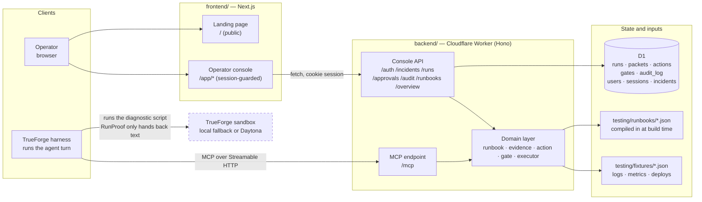
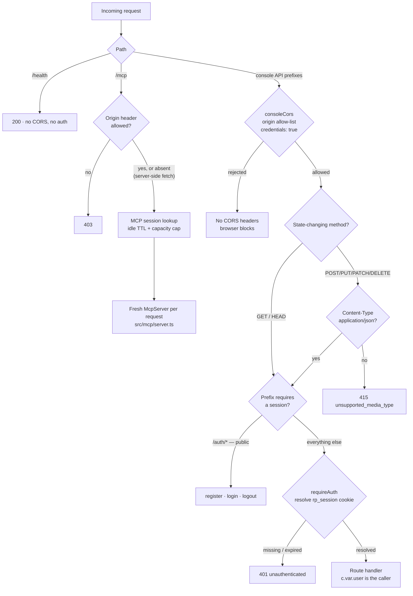
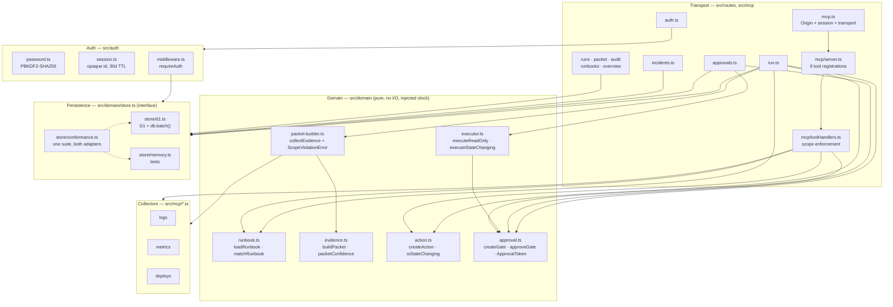
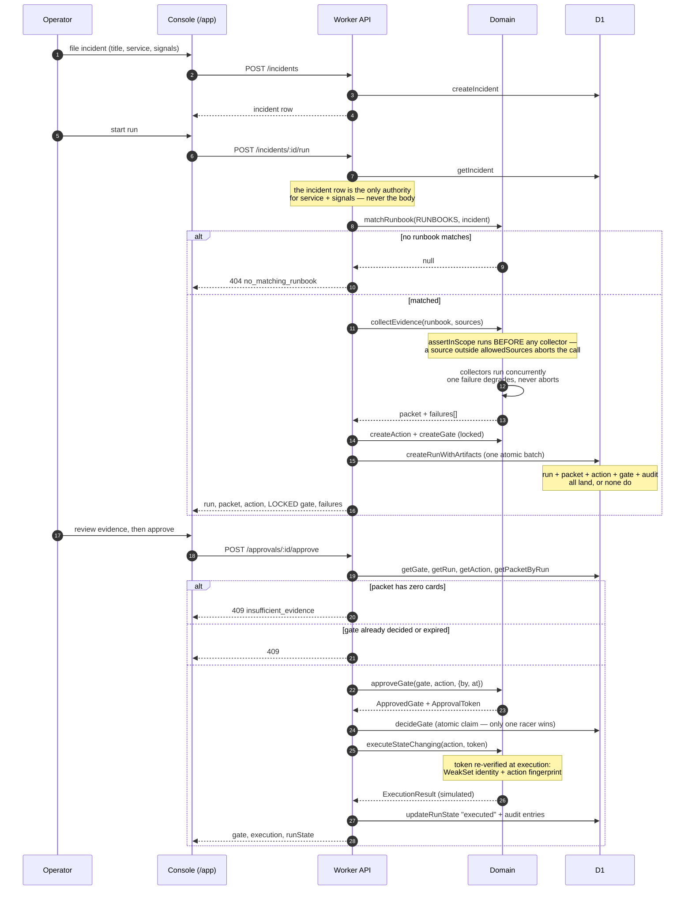
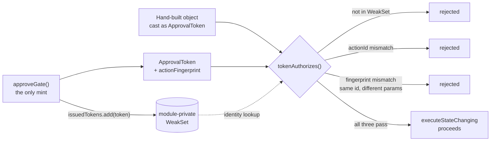
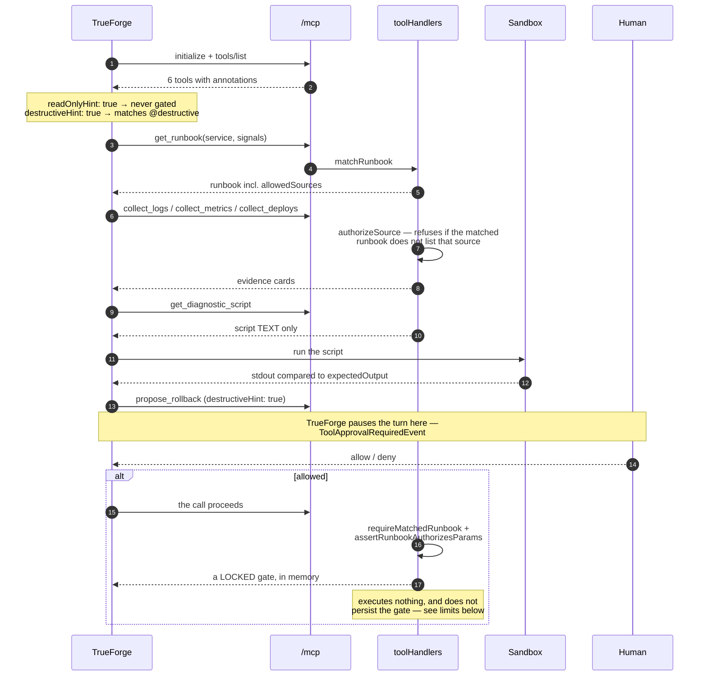
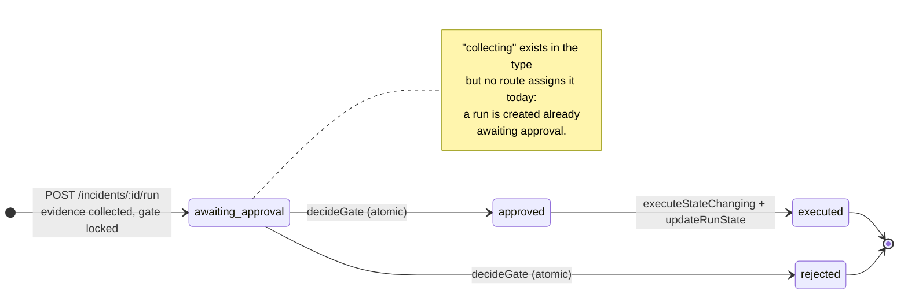
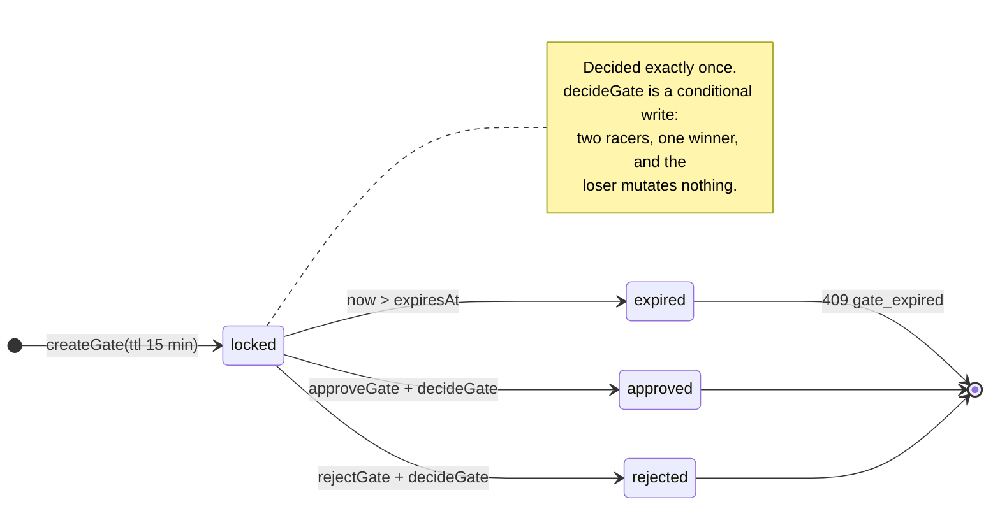
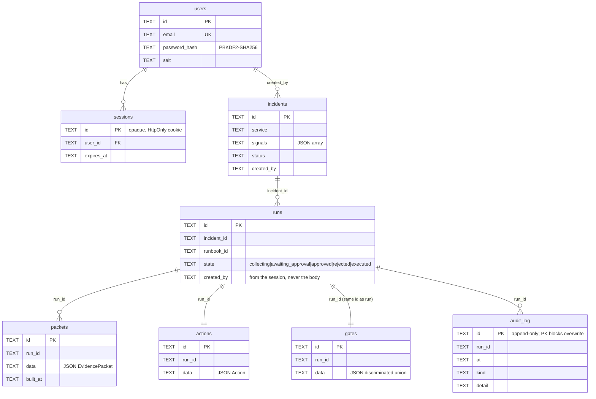
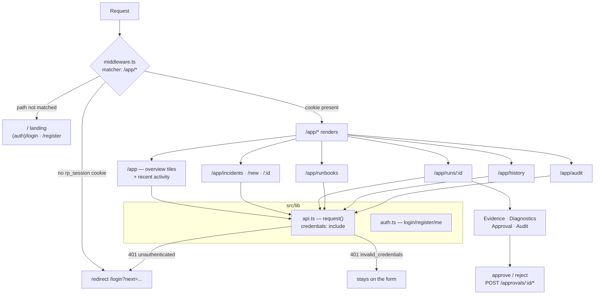

# RunProof Architecture

How the pieces fit, and where each safety property is actually enforced.

This document describes what is in the repository today. Where a diagram shows
something that is deliberately *not* wired up, it says so — see
[Architectural limits](#architectural-limits) and the "What is NOT built"
section of the [README](../README.md).

**Reading order:** [system context](#system-context) → [request pipeline](#request-pipeline)
→ [backend layers](#backend-layers) → the two flows
([operator](#the-operator-flow-http), [agent](#the-agent-flow-mcp)) →
[state machines](#state-machines) → [data model](#data-model).

---

## System context

Two independent clients drive RunProof, and they enter through two different
doors. Nothing in the middle box executes anything.

Three things this diagram is meant to make obvious:

- **RunProof has no execution surface.** It is a Worker: no shell, no
  filesystem, no subprocess. `get_diagnostic_script` returns script *text*;
  the sandbox that runs it belongs to TrueForge.
- **The MCP door and the console door are separate.** They share the domain
  layer, not the request pipeline — different auth, different CORS treatment,
  different threat model.
- **Only the console API touches D1.** The MCP tool handlers are stateless and
  fixture-backed; nothing an agent calls today persists anything.

---

## Request pipeline

`backend/src/index.ts` mounts middleware by path prefix rather than per route,
so a new route under an existing prefix inherits every guard automatically.

Notes that are easy to get wrong when reading the code:

- **The `Content-Type` guard is the CSRF barrier**, not body parsing.
  `c.req.json()` ignores the header entirely, and `POST /auth/logout` reads no
  body at all — both were reachable cross-site before the guard was mounted.
  `SameSite=Lax` on the session cookie is the other, independent barrier.
- **`consoleCors` is never mounted on `/mcp` or `/health`.** `/mcp`'s only
  caller is a server-side fetch that sends no `Origin`; it validates `Origin`
  itself against a separate, wider allow-list (any localhost port).
- **`requireAuth` is a prefix middleware, not a per-route check**, so
  `/incidents/*`, `/runs/*`, `/approvals/*`, `/audit/*`, `/runbooks/*` and
  `/overview/*` cannot grow a route that forgets it.

---

## Backend layers

Routes own I/O and the clock. The domain layer is pure. The store is an
interface with two implementations, so every persistence rule is testable
without D1.

The dependency rule worth preserving: **arrows point inward, and the domain
layer has none pointing out.** `approval.ts` and `executor.ts` never touch a
store, a request, or the wall clock — every timestamp is stamped at the route
boundary and passed in. That is what makes the safety tests deterministic.

---

## The operator flow (HTTP)

The console's path from an incident to an executed action. The important line
is the one that *doesn't* happen: `POST /incidents/:id/run` collects evidence
and locks a gate, and its response has no `execution` field at all.

Four enforcement points on that path, each in exactly one place:

| Property | Enforced by | Failure mode |
|---|---|---|
| Evidence stays inside the runbook's scope | `assertInScope` in `packet-builder.ts` | `403 scope_violation` |
| A run is born whole, or not at all | `Store#createRunWithArtifacts` (`db.batch()`) | nothing written |
| No approval without evidence | `getPacketByRun` check in `approvals.ts` | `409 insufficient_evidence` |
| One decision per gate, ever | `Store#decideGate` conditional write | `409 gate_already_decided` |

### Why the approval token cannot be forged

`approveGate` is the only mint, and the check at execution time is identity-
based, not shape-based.

The TypeScript `unique symbol` brand on `ApprovalToken` is erased at runtime
and stops nothing on its own — the `WeakSet` is the real mechanism. The direct
consequence: **tokens are in-process only and must never be serialized.** A
token that round-trips through JSON legitimately loses its identity and is
rejected. Persist the *gate* (plain data); never the token.

---

## The agent flow (MCP)

What TrueForge drives. The tool annotations are what make the human checkpoint
fire — RunProof declares intent, TrueForge enforces the pause.

`assertRunbookAuthorizesParams` is worth calling out: matching a runbook is not
enough, because a caller could keep the match and swap the params. Every key
the runbook prescribes must compare equal under `stableStringify` — the same
serializer the token fingerprint uses, so the two checks cannot drift on what
"the same value" means. Keys the runbook does not prescribe (`reason`, free-form
operator context) stay unconstrained.

---

## State machines

A run and its gate move together, but they are separate rows with separate
invariants.

---

## Data model

Bodies that are always read whole (`packets`, `actions`, `gates`, incident
`signals`) are stored as opaque JSON and re-validated with their Zod schema on
the way out, rather than decomposed into columns.

The action and gate deliberately **share the run's id**. Separate tables mean no
key collision, and it lets `/approvals/:id` find the run — and therefore the
mutable state it must claim — from the gate id alone.

`audit_log` is append-only, and the `PRIMARY KEY` on `id` is the enforcement:
a second insert with the same id fails rather than silently overwriting. No
`UPDATE` or `DELETE` may ever target that table.

---

## Frontend

The middleware checks only that the cookie is **present** — deliberately. It
exists to stop a flash of protected UI, not to authorize. A present-but-invalid
cookie sails through it and is caught one layer down by `requireAuth`, whose
`401 unauthenticated` the API client turns into a redirect. Keying that redirect
on `error.code` rather than the bare status matters: a failed login is also a
401, and must not bounce the user out of the form they are typing in.

---

## Architectural limits

Known and deliberate, listed here so a diagram above is not read as a promise:

- **The two approval gates are not one pipeline.** `propose_rollback` mints a
  locked gate in memory and returns it in the tool result; it is never written
  to the store, so it cannot be resolved through `/approvals/:id`. An
  agent-proposed rollback and an operator-run one are two flows over the same
  domain machinery today.
- **Execution is simulated.** `executeStateChanging` returns a descriptive
  string. No infrastructure API is called, before or after approval.
- **The MCP session map is process-local** (`src/routes/mcp.ts`). `wrangler dev`
  runs a single isolate, so this is latent locally; a horizontally scaled
  deployment needs a Durable Object per session.
- **Runbooks and evidence are compiled-in fixtures.** `RUNBOOKS` /
  `ALL_RUNBOOKS` are a static import of one JSON file, and the collectors read
  fixture snapshots. The `Runbook`, `EvidenceSource` and `Store` contracts are
  what a real deployment would swap implementations behind.
- **The HTTP run path collects `logs`, `metrics` and `deploys` only.** The
  shipped runbook also authorizes `sandbox`, but sandbox evidence enters only
  through the agent flow, where TrueForge runs the script.
- **No roles.** Every authenticated user can approve anything.

---

## Where to look next

| Question | File |
|---|---|
| What a runbook may authorize | [`docs/runbook-format.md`](runbook-format.md) |
| The full safety argument | [`docs/writeup.md`](writeup.md) |
| Driving it from TrueForge | [`docs/trueforge-setup.md`](trueforge-setup.md) |
| Deploying it | [`docs/cloudflare-deployment.md`](cloudflare-deployment.md) |
| What is left to build | [`docs/roadmap.md`](roadmap.md) |
